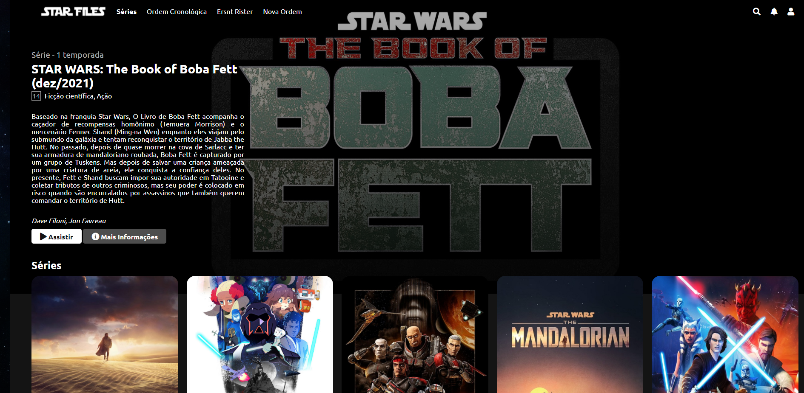

# StarFiles

  
## Apresentação

Meu nome é Gabriel Eduardo Palhares, tenho 24 anos, atualmente estou no segundo período do curso de Análise e Desenvolvimento de Sistemas na Faculdade PUC Minas. Sou apaixonado por tecnologia (antes como usuário, agora como desenvolvedor) e pelas possibilidades que ela nos traz. Sempre me surpreendo com as infinitas possibilidades que temos diante dela, ela nos traz diversos lugares onde podemos expressar nossa criatividade, sentimentos, conhecimentos e o mais legal de tudo: compartilhar isso com outras pessoas.

## Sobre o Projeto

A ideia deste projeto teve como origem a necessidade de criação de uma interface semelhante à da Netflix, em uma etapa do Bootcamp Inter FrontEnd Developer, uma iniciativa da plataforma de estudos Digital Innovation One, em parceria com o Banco Inter. Tendo como base as aulas ministradas pelo professor Felipe Aguiar e os conhecimentos que adquiri ao longo desse Bootcamp,  pude colocar em prática diversos conceitos e ferramentas de programação web que me permitiram a criação dessa página.

O StarFiles foi a ideia que tive quando pensei em inovar e fazer algo além do desafio proposto. Como um fã apaixonado por Star Wars, decidi implementar elementos da saga, tornando o que seria uma "interface padrão da Netflix", em uma webpage que contém informações sobre as novas séries televisivas do universo Star Wars, assim como as diferentes ordens cronológicas dos filmes, algo que é muito curioso, pois vários fãs têm uma visão diferente de qual a mais correta.

Ao navegar pela página, você se depara com vários banners distribuídos em forma de catálogos e você tem a opção de explorar o conteúdo além dessa simples parte visual! Ao clicar no banner do filme ou série respectivo, você é redirecionado para o site oficial de Star Wars, onde há mais informações e detalhes disponíveis sobre cada produção.

## Links

[StarFiles - webpage](https://gabriel-palhares.github.io/starfiles/) 
[LinkedIn](https://www.linkedin.com/in/gabrielpalhares-) 
[Plataforma da DIO](https://www.dio.me/) 
[Banco Inter](https://www.bancointer.com.br/)
